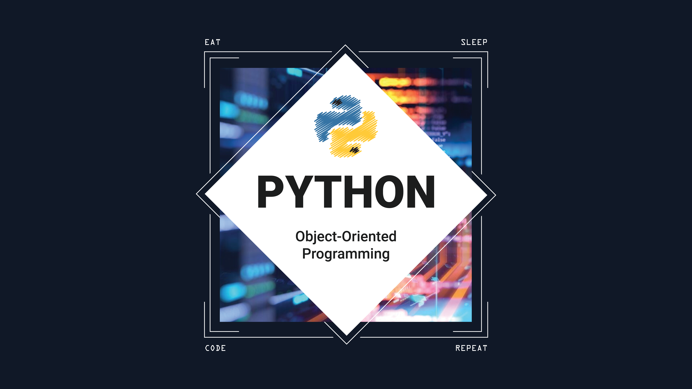

# CRUD Application in Object-Oriented Programming

## Background
Object-Oriented Programming (OOP) is a programming paradigm that structures code around the concept of "objects". Objects are instances of classes, which are templates or blueprints for creating objects. OOP focuses on modeling real-world entities and their interactions using classes and objects. It promotes encapsulation, inheritance, and polymorphism as core concepts.

## Table of Contents
- [Introduction](#introduction)
- [Features](#features)
  - [Create](#create)
  - [Read](#read)
  - [Update](#update)
  - [Delete](#delete)
- [Installation](#installation)
- [Class Structure](#class-structure)

## Introduction
Python is a popular programming language known for its simplicity and ease of use. One of the most common applications of Python is for creating CRUD application to a wide range of use cases. As for my project, this can be useful for managing and manipulating amounts of personal patient data by providing an easy-to-use interface which is customized to meet specific requirements or additional features such as data validation. As for the storage file format, we will be using CSV (Comma-Separated Values) which is a lightweight and accessible file format used for storing tabular data, or information presented in a table with rows and columns. Overall, this is just a small start of understanding the basic concepts of creating CRUD application in Object-oriented Programming Paradigm.

## Features
CRUD is an acronym that stands for Create, Read, Update, and Delete. It refers to the basic operations that are commonly performed on data stored in a database that provides an interface for users to interact with a database by performing these basic operations.

### Create
The application enables users to create new records in the database. It provides a user-friendly interface to input data and add new entries.

### Read
Users can retrieve and view existing records from the database. The application offers options to search for specific records and then provides with modifying features such as data updating and deleting.

### Update
The update feature allows users to modify the data of existing records. It presents a simple way to edit and update the information in the database.

### Delete
Users can delete records from the database. The application ensures data integrity by confirming deletion actions.

## Installation
To run the CRUD application, you need to have Python installed on your system with few additional libraries to interact with CSV files used as data storage. We use Command-Line Interface (CLI) to interact with the files instead of a graphical user interface (GUI). CLI can be used in CRUD applications and is particularly useful when efficiency, flexibility, portability, or security are important factors.

## Class Structure
The project is organized using an OOP approach. The main classes include:
- `Initialize`: Intended to initialize and terminate the main program and includes few methods in data verification and input handling.
- `Create`: Handles data creation with few methods specifically functioning for data saving and duplicates checking.
- `Search`: Provides a way to retrieve certain data based on intended key and grants users to modify it.

---

For the article worth reading, I recommend you visit the project on [my website](https://reyharighy.github.io/my-simple-website/porto4.html). For questions or collaborations, please contact me through [email](mailto:arighymoch@gmail.com).
